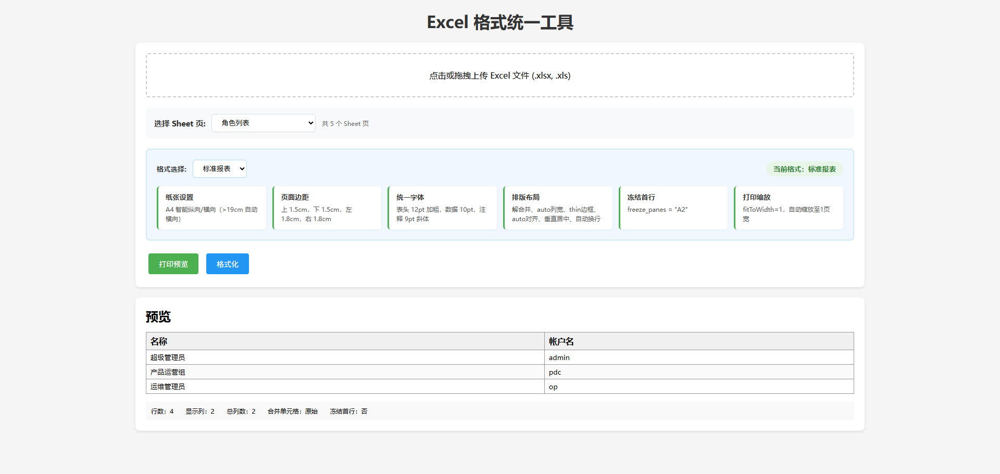

# Excel 格式统一工具

[English Version](README_EN.md)

一个纯前端的 Excel 格式统一工具，解决 Excel 文件中字体、边距、纸张尺寸、排版结构等格式不统一的问题。



## 功能特性

- **纸张设置**：统一为 A4 纸张，支持智能纵向/横向自动切换（内容宽度 > 19cm 自动横向）
- **页面边距**：统一上下左右边距配置
- **统一字体**：表头、数据、注释行分别设置字号和样式
- **排版布局**：解合并单元格（按上一行对应列的值填充）、自动列宽、边框、对齐方式、自动换行
- **冻结首行**：自动冻结表头行，方便滚动查看
- **打印缩放**：自动缩放至 1 页宽，确保打印效果
- **多 Sheet 支持**：支持选择 Excel 文件中的不同 Sheet 页
- **列显示管理**：列数过多时可选择显示/隐藏特定列
- **格式预设**：内置 4 种格式预设（标准报表、宽表报表、紧凑型、正式文档）
- **自定义配置**：支持 YAML 配置文件自定义格式规则
- **导出 Excel**：导出格式化后的 Excel 文件，保留页面设置
- **打印预览**：支持浏览器打印预览

## 快速开始

### 方式一：直接打开

直接双击 `excel-formatter.html` 文件在浏览器中打开即可使用。

### 方式二：本地服务器（推荐）

```bash
# 使用 Python
cd Excel统一格式工具
python -m http.server 8080

# 然后访问 http://localhost:8080/excel-formatter.html
```

## 使用说明

1. **上传文件**：点击上传区域或拖拽 Excel 文件（.xlsx/.xls）到页面
2. **选择 Sheet**：多 Sheet 文件可选择要处理的 Sheet 页
3. **选择格式**：从下拉框选择预设格式或上传自定义 YAML 配置
4. **列管理**：列数 > 8 时会自动显示列选择器，可勾选需要显示的列
5. **格式化**：点击"格式化"按钮处理数据
6. **导出/打印**：格式化完成后可导出 Excel 或打印预览

## 配置文件

配置文件位于 `config/formatter-config.yaml`，支持以下配置项：

```yaml
paper:
  size: A4                    # 纸张尺寸
  orientation: auto           # auto/portrait/landscape
  landscape_threshold: 19     # 自动横向阈值(cm)

margins:
  top: 1.5                    # 上边距(cm)
  bottom: 1.5                 # 下边距(cm)
  left: 1.8                   # 左边距(cm)
  right: 1.8                  # 右边距(cm)

font:
  header:
    size: 12
    bold: true
  data:
    size: 10
  note:
    size: 9
    italic: true

layout:
  unmerge:
    enable: true
    fill_mode: previous_row
  column_width:
    mode: auto
  border:
    style: thin
  alignment:
    horizontal: auto
  wrap_text: true

freeze:
  enable: true
  pane: "A2"

print:
  enable: true
  fit_to_width: 1
```

## 内置预设

| 预设名称 | 说明                            |
| -------- | ------------------------------- |
| 标准报表 | 默认配置，A4 智能方向，标准边距 |
| 宽表报表 | 横向布局，窄边距，适合宽表      |
| 紧凑型   | 小边距，小字号，节省空间        |
| 正式文档 | 纵向布局，宽边距，大字号        |

## 技术栈

- **HTML/CSS/JavaScript**：纯前端实现，无需后端
- **SheetJS (xlsx)**：Excel 文件解析和生成
- **js-yaml**：YAML 配置文件解析

## 浏览器兼容性

支持现代浏览器：Chrome、Edge、Firefox、Safari

## 许可证

MIT License
